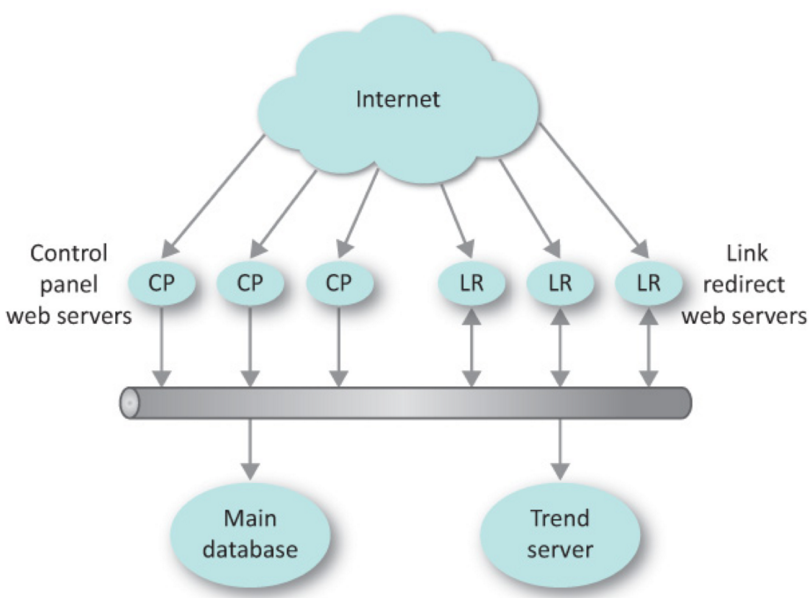

# What it does
With URL shortener you can get a short url link for your long URL.

* Paste your long URL and click on generate short url
* Keep track on the number of hits on your link (trending charts) 
* After logging into your account you can keep track of multiple URLs

# Underlying Technology
Cloud scalable URL shortening Web App consists of Link Redirect Server, Trend Server and a Database

* Nodejs Web App  
* Developed using Amazon Web Services: EC2, Elastic Load Balancing, Auto Scaling, RDS, VPC, Route 53
* Deployed on Heroku

# Architecture 
####Components:
* Web Portal: a Heroku Based Web Application from which requests for URLs can be submitted and Trending data can be viewed.
* Control Panel: A web service to create new shortlinks.
* Main Database: A database server that stored all the shortlink information.
* Trend Server: A server that kept track of “trending links” statistics.
* Link Redirect Servers: Web servers that received requests with short URLs and replied with a redirect to the expanded URL
 

# Appendix
Thanks to [The Practice of Cloud System Administration: Designing and Operating Large Distributed Systems](https://www.safaribooksonline.com/library/view/the-practice-of/9780133478549/)
